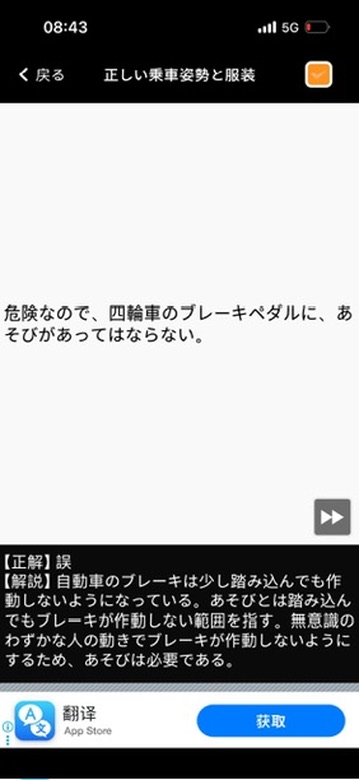
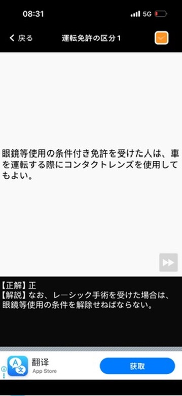
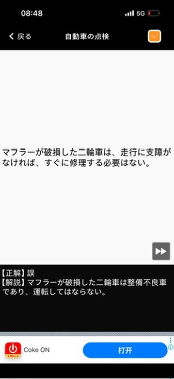
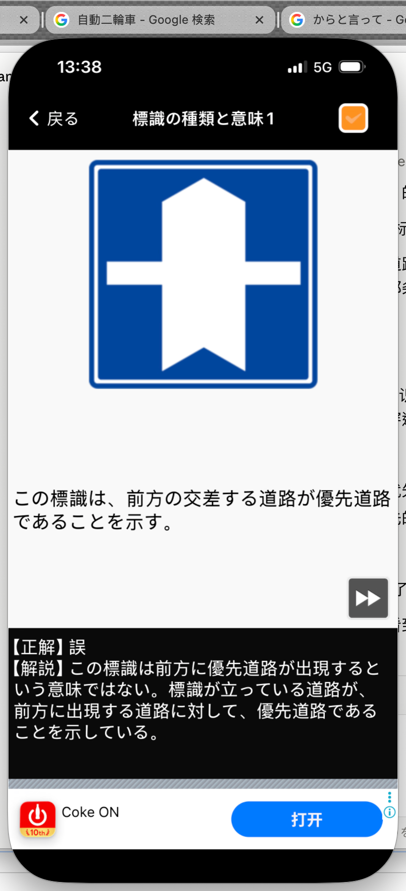

# 仮免許学科試験　間違えた問題まとめ

**学習日：** 2026年6月15日（Day 1）

---

## Q1｜正しい乗車姿勢と服装

**問題：**
> 危険なので、四輪車のブレーキペダルに、あそびがあってはならない。

**正解：** ❌ 誤

**解説：**
自動車のブレーキは少し踏み込んでも作動しないようになっている。「あそび」とは踏み込んでもブレーキが作動しない範囲を指す。無意識のわずかな人の動きでブレーキが作動しないようにするため、あそびは**必要**である。

---

## Q2｜運転免許の区分１

**問題：**
> 眼鏡等使用の条件付き免許を受けた人は、車を運転する際にコンタクトレンズを使用してもよい。

**正解：** ⭕ 正

**解説：**
コンタクトレンズは「眼鏡等」に含まれるため、使用可能。なお、レーシック手術を受けた場合は、眼鏡等使用の**条件を解除**しなければならない。

---

## Q3｜自動車の点検

**問題：**
> マフラーが破損した二輪車は、走行に支障がなければ、すぐに修理する必要はない。

**正解：** ❌ 誤

**解説：**
マフラーが破損した二輪車は**整備不良車**に該当し、走行に支障がなくても運転してはならない。

---

## Q4｜標識の種類と意味１

**問題：**
> この標識は、前方の交差する道路が優先道路であることを示す。

**正解：** ❌ 誤

**解説：**
この標識（青地に白い十字）は「前方に優先道路が出現する」という意味ではない。**標識が立っている道路（自分が走っている道路）が**、前方で交差する道路に対して優先道路であることを示している。

---

## まとめ表

| # | カテゴリ | 問題のポイント | 正解 |
|---|---------|-------------|------|
| 1 | 正しい乗車姿勢と服装 | ブレーキペダルの「あそび」は必要か | 誤（あそびは必要） |
| 2 | 運転免許の区分１ | 眼鏡条件付き免許でコンタクト使用可否 | 正（使用可） |
| 3 | 自動車の点検 | マフラー破損車の運転可否 | 誤（運転不可） |
| 4 | 標識の種類と意味１ | 優先道路標識の意味 | 誤（自分の道が優先） |
