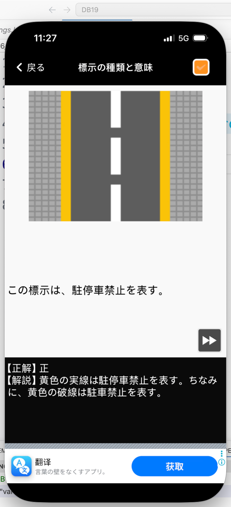
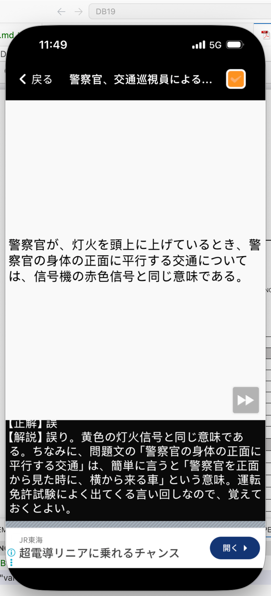

# 仮免許学科試験　間違えた問題まとめ

**学習日：** 2026年6月16日（Day 2）

---

## Q5｜標示の種類と意味

**問題：**
> この標示は、駐停車禁止を表す。（黄色の実線）

**正解：** ⭕ 正

**解説：**
黄色の**実線**は「駐停車禁止」を表す。ちなみに、黄色の**破線**は「駐車禁止」を表す。

| 標示 | 意味 |
|------|------|
| 黄色の実線 | 駐停車禁止 |
| 黄色の破線 | 駐車禁止 |

---

## Q6｜警察官・交通巡視員による手信号

**問題：**
> 警察官が、灯火を頭上に上げているとき、警察官の身体の正面に平行する交通については、信号機の赤色信号と同じ意味である。

**正解：** ❌ 誤

**解説：**
灯火を頭上に上げているときは、**黄色の灯火信号**と同じ意味である（赤ではない）。

> **覚え方のポイント：**
> 「警察官の身体の正面に平行する交通」＝警察官を正面から見たとき、**横から来る車**のこと。試験に頻出の言い回しなので確実に覚えること。

| 警察官の動作 | 正面に平行する交通 | 正面に向かう交通 |
|------------|-----------------|----------------|
| 灯火を頭上に上げる | 黄色信号と同じ | 黄色信号と同じ |
| 腕を横に水平に上げる | 赤色信号と同じ | 青色信号と同じ |

---

## まとめ表

| # | カテゴリ | 問題のポイント | 正解 |
|---|---------|-------------|------|
| 5 | 標示の種類と意味 | 黄色実線は駐停車禁止か | 正（駐停車禁止） |
| 6 | 警察官・交通巡視員による手信号 | 灯火頭上＝赤色信号と同じか | 誤（黄色信号と同じ） |
