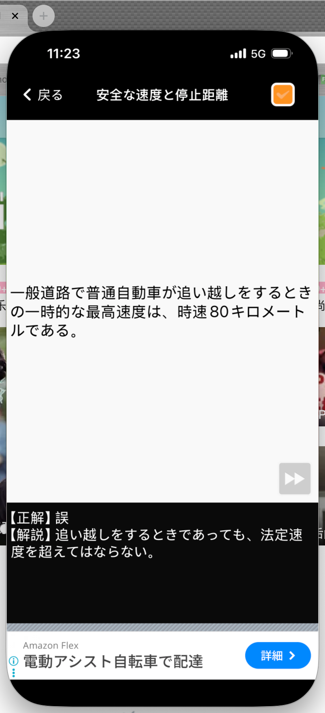
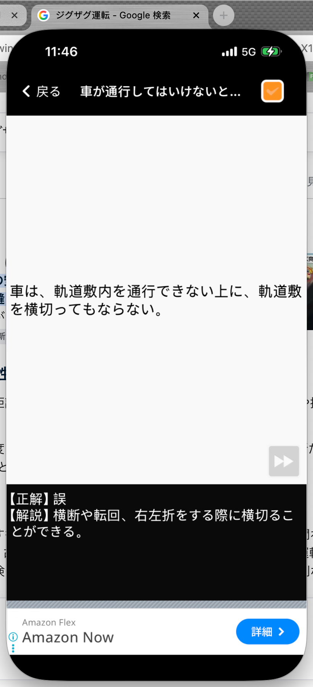
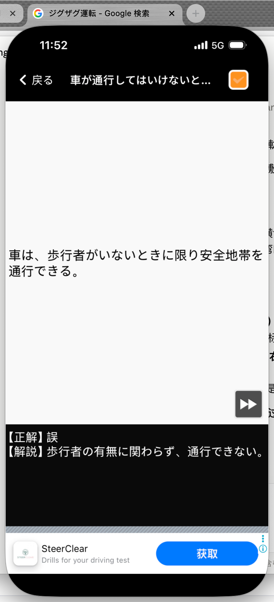

# 仮免許学科試験　間違えた問題まとめ

**学習日：** 2026年6月18日（Day 3）

---

## Q7｜安全な速度と停止距離

**問題：**
> 一般道路で普通自動車が追い越しをするときの一時的な最高速度は、時速80キロメートルである。

**正解：** ❌ 誤

**解説：**
追い越しをするときであっても、**法定速度を超えてはならない**。一般道路の法定速度は時速60km/hであり、追い越し中だからといって80km/hまで出してよいわけではない。

---

## Q8｜車が通行してはいけない場所

**問題：**
> 車は、軌道敷内を通行できない上に、軌道敷を横切ってもならない。

**正解：** ❌ 誤

**解説：**
軌道敷内の通行は原則禁止だが、**横断・転回・右左折のために横切ることは可能**。「通行できない＝横切りも絶対禁止」と思い込まないこと。

| 行為 | 可否 |
|------|------|
| 軌道敷内を走行（通行） | ❌ 禁止 |
| 横断・転回・右左折のために横切る | ✅ 可能 |

---

## Q9｜車が通行してはいけない場所

**問題：**
> 車は、歩行者がいないときに限り安全地帯を通行できる。

**正解：** ❌ 誤

**解説：**
安全地帯は**歩行者の有無に関わらず、車は一切通行できない**。「歩行者がいなければOK」という条件は存在しない。

---

## まとめ表

| # | カテゴリ | 問題のポイント | 正解 |
|---|---------|-------------|------|
| 7 | 安全な速度と停止距離 | 追い越し時に時速80kmまで出せるか | 誤（法定速度を超えてはならない） |
| 8 | 車が通行してはいけない場所 | 軌道敷を横切ることも禁止か | 誤（横断等のための横切りは可） |
| 9 | 車が通行してはいけない場所 | 歩行者がいなければ安全地帯を通行できるか | 誤（歩行者の有無に関わらず禁止） |
