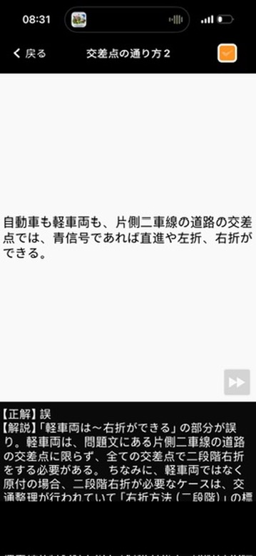
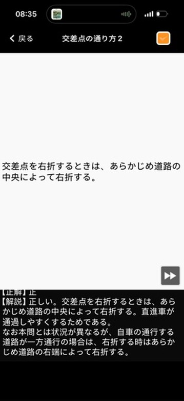

# 仮免許学科試験　間違えた問題まとめ

**学習日：** 2026年6月22日（Day 4）

---

## Q10｜交差点の通り方２

**問題：**
> 自動車も軽車両も、片側二車線の道路の交差点では、青信号であれば直進や左折、右折ができる。

**正解：** ❌ 誤

**解説：**
「軽車両は〜右折ができる」の部分が誤り。軽車両は、片側二車線の道路の交差点に限らず、**すべての交差点で二段階右折をする必要がある**。

> **補足：**
> 軽車両ではなく原付の場合、二段階右折が必要なケースは、交通整理が行われていて「右折方法（二段階）」の標識がある交差点、または片側三車線以上の交差点に限られる。

---

## Q11｜交差点の通り方２

**問題：**
> 交差点を右折するときは、あらかじめ道路の中央によって右折する。

**正解：** ⭕ 正

**解説：**
正しい。交差点を右折するときは、あらかじめ**道路の中央**によって右折する。直進車が通過しやすくするためである。

> **補足（状況が異なるケース）：**
> 自車の通行する道路が**一方通行**の場合は、右折するときはあらかじめ**道路の右端**によって右折する。

| 道路の種類 | 右折時に寄せる位置 |
|-----------|-----------------|
| 通常の道路 | 道路の中央 |
| 一方通行の道路 | 道路の右端 |

---

## まとめ表

| # | カテゴリ | 問題のポイント | 正解 |
|---|---------|-------------|------|
| 10 | 交差点の通り方２ | 軽車両は青信号で右折できるか | 誤（軽車両は二段階右折が必要） |
| 11 | 交差点の通り方２ | 右折時は道路の中央に寄せるか | 正（一方通行なら右端） |
