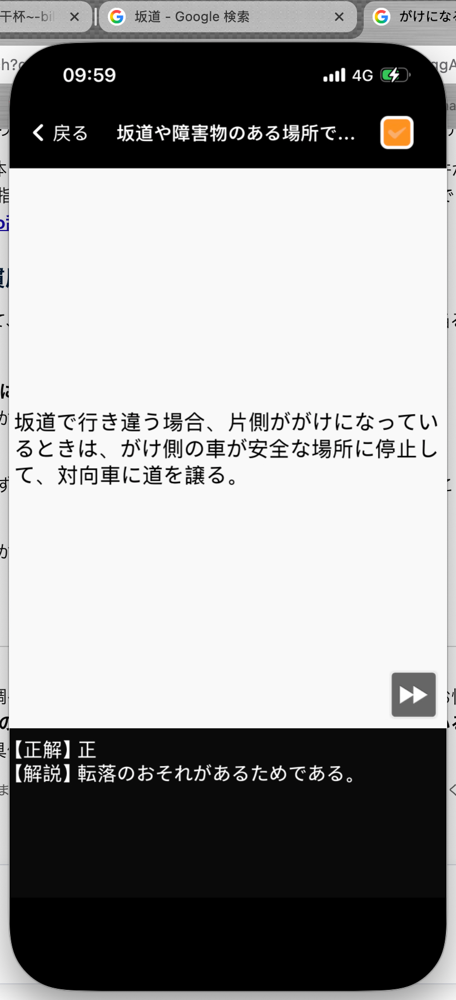
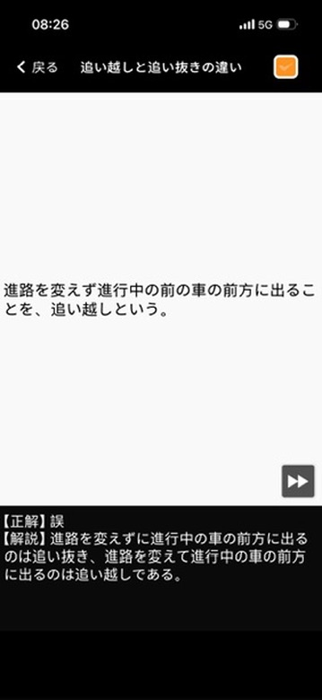

# 仮免許学科試験　間違えた問題まとめ

**学習日：** 2026年6月29日（Day 5）

---

## Q12｜坂道や障害物のある場所での行き違い

**問題：**
> 坂道で行き違う場合、片側ががけになっているときは、がけ側の車が安全な場所に停止して、対向車に道を譲る。

**正解：** ⭕ 正

**解説：**
正しい。片側ががけになっている坂道では、**がけ側の車**が安全な場所に停止して道を譲る。**転落のおそれ**があるためである。

> **覚え方のポイント：**
> がけ側＝落ちる危険があるほうが止まって待つ。危険な側が譲ると覚える。

---

## Q13｜追い越しと追い抜きの違い

**問題：**
> 進路を変えず進行中の前の車の前方に出ることを、追い越しという。

**正解：** ❌ 誤

**解説：**
進路を**変えずに**前車の前方に出るのは「**追い抜き**」、進路を**変えて**前車の前方に出るのが「**追い越し**」である。

| 用語 | 進路変更 | 内容 |
|------|---------|------|
| 追い越し | あり（変える） | 進路を変えて前車の前方に出る |
| 追い抜き | なし（変えない） | 進路を変えずに前車の前方に出る |

---

## まとめ表

| # | カテゴリ | 問題のポイント | 正解 |
|---|---------|-------------|------|
| 12 | 坂道や障害物のある場所での行き違い | がけ側の車が停止して道を譲るか | 正（転落のおそれがあるため） |
| 13 | 追い越しと追い抜きの違い | 進路を変えず前方に出るのは追い越しか | 誤（それは追い抜き） |
